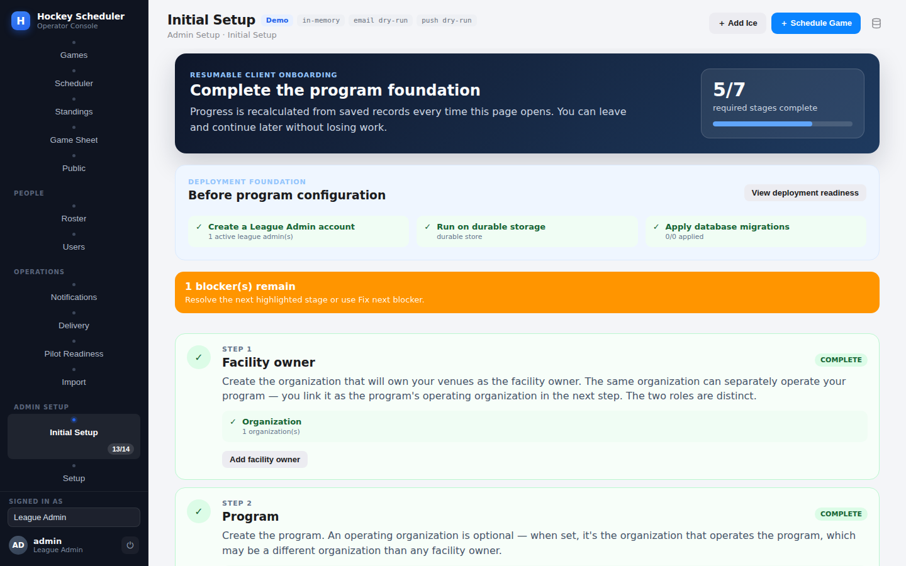
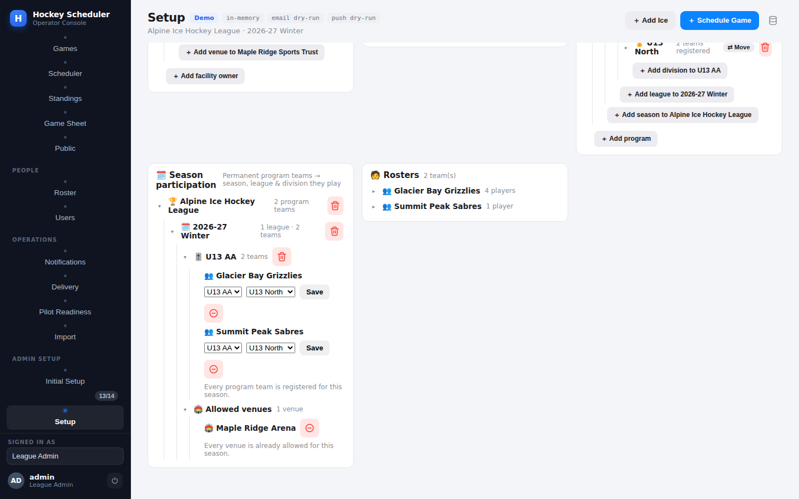
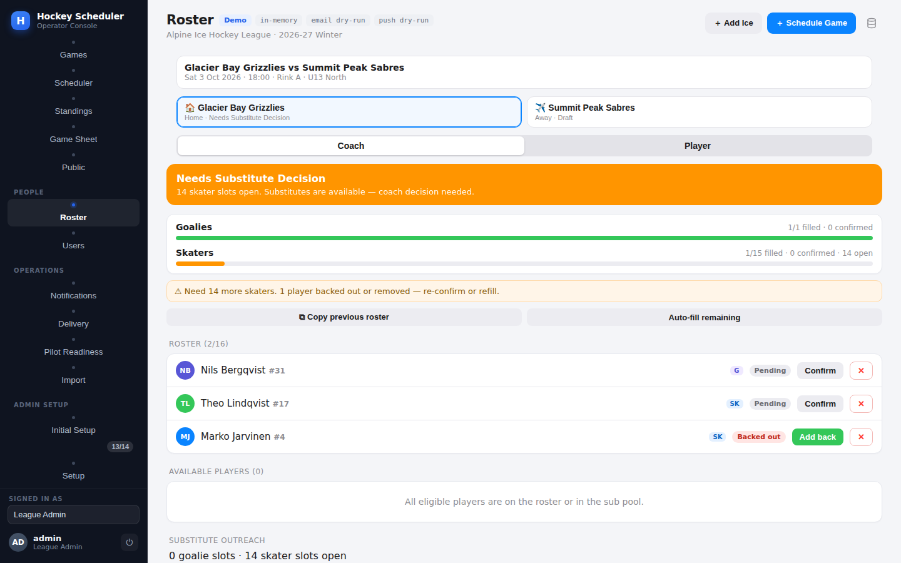

# Hockey Scheduler — Expert Application Review

**Reviewed by:** an ice-hockey coach and league administrator's lens — six decades around rinks, benches, and league offices, from junior house leagues to championship tournaments. The review evaluates the application the way a real league operator would live in it: standing up a league from nothing, adding and managing every player, running a game-day roster, and handling parents, officials, and the public schedule.

**Application:** hockey-scheduler (jingizoo/biknik, branch main @ 8cbe003)  
**Review date:** 16 July 2026  
**Method:** hands-on. The backend was run locally (in-memory store), and every player-related flow was exercised live through the real HTTP API and the web operator console, with deliberate bad inputs to probe validation. Code, migrations, and the test suite were read in full alongside the live probes. Every finding below is backed by an actual request/response or a file-and-line reference.

## 1. Executive summary

This is a genuinely well-engineered league *operations* platform with an unusually disciplined core: clean layering (domain / services / store / API / web), an audit trail on every mutation, dependency-gated deletions that refuse to orphan records, a guardian-consent flow that takes junior privacy seriously, and a roster engine that counts goalies and skaters separately — something even commercial products get wrong. The substitute workflow (player backs out → coach immediately sees 'open slot' vs 'substitute available') is the standout feature and it works exactly as advertised.

Where it falls short is the *hockey* in the player record. A player today is a name, a coarse position, an optional jersey number, and a team. There is no birthdate — in a junior league that means age eligibility for a U13 division cannot be verified at all. There is no way to edit a player after creation (a typo in a kid's name means delete-and-recreate). Jersey number 17 can be issued twice on the same team, and number 131 is accepted even though the rulebook stops at 98. There are no game statistics, no penalties, and no suspension tracking, so the league cannot yet run discipline or scoring races. And one security gap needs fixing before more people get accounts: a coach account created without a team scope silently receives authority over *every* team's roster.

Verdict: the foundation deserves to be built on — the priorities for the next few pull requests are player identity (birthdate, edit endpoint, jersey rules), the coach-scope fail-open, and then the scoring/penalty layer that turns a scheduler into a league system.

## 2. How the review was performed

- Started the server with `python3 -m hockey_scheduler.web` (in-memory store, demo mode) and signed in as the seeded League Admin (`admin`/`demo`).
- Followed the first-run onboarding checklist and built a complete league by hand through the API: organization → program → season → level → division → club → two teams → season registrations → venue → rink → ice slot → season-venue access → game.
- Created players through `/api/setup/player` including deliberate bad inputs: duplicate jersey numbers, jersey 0 and 131, position 'center', blank names, duplicate names, and a missing team id.
- Exercised update paths (team reassignment; attempted PUT/PATCH edits), the v1 and v2 delete routes, and the dependency gate on a player with an email contact.
- Ran the flagship game-day flow: roster selection, a player backing out, roster-status recalculation, substitute enrolment, and add-to-roster.
- Created coach and guardian accounts, verified the guardian consent flow end-to-end, and probed role/scope enforcement — including what an unscoped coach can do.
- Read the domain models, services, migrations (001–033), authorization code, and the ~130-file test suite; captured operator-console screenshots of each surface reviewed.

## 3. The journey — living in the app as an operator

### 3.1 First run, login, and onboarding

Login is a session cookie (`hs_sid`, HttpOnly, SameSite=Lax, Secure in production). The seeded demo admin signs in cleanly and lands on a real operator dashboard. The first-run experience is the best part of the whole journey: a resumable 'Initial Setup' wizard recalculates progress from saved records every time it opens, shows deployment-foundation checks (admin account, durable storage, migrations) and walks through facility owner → program → venues → season/league → clubs/teams → players & officials → game ice → staff accounts → review. Blockers are explicit ('1 blocker(s) remain — resolve the next highlighted stage'). A new league administrator cannot get lost.

*The resumable onboarding wizard: progress is recomputed from records, blockers are explicit.*

**Comment:** onboarding of this quality is rare. The 'Fix next blocker' pattern should be kept and extended to scheduling-time errors too (see the venue-access finding in 3.2).

### 3.2 Building the world (hierarchy setup)

The nine-entity hierarchy (organization, program, season, league/level, division, club, team, venue/rink/ice slot, plus season registrations and venue access) mirrors how real associations are structured, and the canonical v2 model per ADR 0001 is the right shape: Teams are permanent to a program; their seasonal division placement is a `SeasonTeamRegistration`. Season roll-forward exists — real leagues re-register the same teams every September, so this is exactly right.

Friction points found live while building:

- **Season dates demand full timestamps.** `start_date: "2026-09-15"` is rejected with 'expected a timezone-aware ISO-8601 UTC timestamp'. League seasons are dates, not instants; the API should accept `YYYY-MM-DD`.
- **The venue-access gate tells you what, not how.** Creating the first game fails with 'The selected ice slot's venue is not allowed for this season' (`venue_access_missing`). Correct integrity rule (new in the SeasonVenueAccess work), and the structured `details` are good — but nothing tells the operator that the fix is `POST /api/v2/setup/seasons/{id}/venue-access`. The onboarding wizard covers it; the raw error should too.
- **Double-booking is properly rejected** — a second game on the same ice slot returns `schedule_conflict: Ice slot slot_1 is not available.` Exactly right, and enforced at the database too (migration 022, one active game per slot).

*Setup records: the season-participation tree, allowed venues, and team rosters built during this review.*

### 3.3 Accessing players

Players live on the Setup screen (Players card and per-team roster tree) and via `GET /api/players[?team_id=]`. Access is gated by `MANAGE_SETUP` — only the League Admin role — and the code comments the reason: most players are juniors, so no player name is ever exposed without a session. The public fixture page carries fixtures only, and an unpublished game 404s publicly. This privacy discipline was verified live and is worth explicit praise.

**Gap:** a coach cannot *list* their own team's players through any read endpoint — player reads are admin-only, yet coaches manage rosters built from those same players. The roster screens work around this by embedding player data in game-scoped responses, but a team-scoped read for coaches is the obvious next step.

### 3.4 Adding a player

`POST /api/setup/player` (the UI posts to the v2 twin) takes: team id (required — the team must already exist), name (required, trimmed), position (goalie / defense / forward / skater), optional jersey number, optional email. An email does not live on the player: it becomes a `ContactDestination` (`player:<id>`, EMAIL channel) used by the notification system — a clean separation. Creation writes a `player_added` audit entry attributed to the *server-resolved* session user, so the trail cannot be forged by a client-supplied actor id. That is the correct instinct throughout this codebase.

Live validation probe results, exactly as the API answered:

| Probe | Result | Assessment |
|---|---|---|
| Goalie, #31, with email | Created; email became a contact destination | Correct |
| Second player with jersey #17 on the same team | **Accepted silently** | Wrong — one number, one sweater. Rulebooks require unique numbers per team |
| Jersey 131 | **Accepted** | Wrong — legal range is 1–98 (99 is retired league-wide in the NHL; IIHF caps at 98/99) |
| Jersey 0 | Rejected: 'jersey_number must be a positive number.' | Right result; note goalie #0/#00 has history but is banned in modern play, so rejecting is fine |
| Position 'center' | Rejected with allowed values listed | Good error message; but see 5.2 — F/D/G is too coarse for line-ups |
| Blank name | Rejected: 'name is required.' | Correct |
| Exact duplicate name 'Theo Lindqvist' on same team | **Accepted silently** | Risky — two identical names with no birthdate or number to tell them apart breaks substitute offers and game sheets |
| Missing team_id | 'Team None not found.' | Behaviour right (a player must have a team), message leaks a Python None — should be a validation error naming the field |

**Also missing at creation:** there is no birthdate field at all, and the domain model's `shoots` (L/R hand) field exists in the dataclass and the database but is *never settable* from any create, import, or edit path — it is dead weight serialized as `null` in every API response, together with the equally dead `guardian_person_id`.

### 3.5 Updating a player — the biggest workflow hole

There is **no way to edit a player**. Not the name, not the position, not the jersey number, not the active flag. The complete update surface today is a single operation: reassign to another team (`POST /api/setup/player/{id}/assign-team`), which works and audits correctly — moving my duplicate-jersey test player to the second team succeeded (and, note, no jersey-conflict check ran on the destination team either). Attempts to PUT or PATCH a player return the Python stdlib's raw HTML 501 page — not even the JSON error envelope the rest of the API speaks.

Think about what this means at a real rink: a parent points out their child's name is misspelled on the game sheet. The operator must delete the player and re-create them. But if the player has an email contact, a roster entry, an availability response, or a guardian link, the (otherwise excellent) dependency gate *blocks the delete* until each of those is manually stripped. So fixing a typo in a name can require: remove contact → delete player → re-create player → re-add contact → re-select on roster → re-link guardian → re-verify consent. That is not a workflow anyone will follow; they will live with the wrong name, and the data rots. A `player_updated` endpoint with an audit entry is the single highest-value small change this application can make.

### 3.6 Deactivating and deleting

- **Delete works and is properly guarded** — but only on the v2 route. `/api/setup/player/{id}/delete` (v1) answers 'Unknown setup entity' while `/api/v2/setup/player/{id}/delete` succeeds. An operator or script using the v1 family will conclude deletion is unsupported.
- **The dependency gate is exemplary.** Deleting the goalie with an email contact was refused with a structured, human-readable breakdown: "Can't delete this player — 1 dependent record(s) still exist (1 contact destination). Remove them first.", listing the exact record. Nothing cascades silently. This is how destructive operations should behave everywhere.
- **But there is no deactivate.** `is_active` is accepted at creation and respected by roster logic, yet no endpoint toggles it afterwards. Hockey has injured reserve, players who move away mid-season, kids who quit in November. Retiring a player (keep history, block rostering) is the operation leagues actually need — deletion is for data-entry mistakes only.

### 3.7 Game-day roster and the substitute engine — the crown jewel

This flow was run end-to-end live: select three players onto the roster for the scheduled game, have a skater back out, watch the status flip to 'open_slot' with `action_required: true` and a precise message, enrol a substitute into the pool, and add them to the roster. Goalie and skater slots are counted independently the entire way (target 1 G / 15 SK, max 18), a removed player's row is revived on re-selection rather than duplicated (backed by a partial unique index, migration 023), and roster lock disables player actions. The operator console renders all of it faithfully — separate goalie/skater fill bars, a 'Needs Substitute Decision' banner, per-player Confirm / Backed out / Add back states, and 'Copy previous roster' / 'Auto-fill remaining' conveniences.

*The substitute workflow live during this review: back-out detected, goalie and skater slots tracked separately.*

**Comment from the bench:** this is the one place the app already beats the spreadsheets every real league secretly runs on. Two refinements would finish it: (a) the availability endpoint silently ignored an unrecognized body key in my probe (posted `status`, engine recorded `pending`) — strict body validation would have caught my mistake; lenient parsing on write APIs hides client bugs; (b) substitute candidates are position-aware but not *line*-aware — see 5.3.

*Operator dashboard: needs-attention queue (missing officials, unconfirmed roster) and live standings.*

### 3.8 Guardians and juniors

The guardian model is the most legally literate part of the system: a guardian *account* is linked to a player, the link starts unverified and inert, and verification requires a recorded consent method with timestamp (GDPR Article 8 is cited in the code). Verified live: before verification the guardian's home screen shows no juniors; after `verify` with `consent_method: verbal_in_person` the junior appears with games, substitute offers, and notification state. Guardians act only through dedicated `/api/me/guardian/*` routes, and the scope layer explicitly refuses guardian actions on general player routes so the link check cannot be side-stepped. Excellent.

**Gap:** guardian links are created by username lookup on an already-created account — there is no invite flow (email a parent, they set a password, link verifies on acceptance). Today an operator must mint the parent's account, tell them the password out-of-band, create the link, then verify consent. Workable for a pilot, heavy for a 200-family club.

### 3.9 Accounts, roles, and the one serious security finding

Seven roles exist (league_admin, arena_manager, coach, player, guardian, official, viewer) with a clean permission map; only League Admin holds `manage_setup`/`manage_users`. Denials are wonderfully clear — a coach creating a player gets: "Your role (Coach) can't do this (requires manage_setup)." Session administration (list/revoke per account, deactivation kills live sessions) is production-grade.

**F-1 (blocker): an unscoped coach has authority over every team's roster.** Live proof: a coach account was created with `team_id` passed at the top level of the body instead of inside `scope` — the API *silently dropped it* and created the account with `scope: {}`. That unscoped coach then successfully removed a player from a game they had no relation to. Root cause is a deliberate fail-open in `web/scope.py` (`if not team: return None  # unbound coach (dev fallback)`) combined with account creation that validates `player_id`/`official_id` scopes but never requires or validates `team_id` for a coach. Any admin who mistypes the scope key mints a league-wide coach and nothing warns them. Fail closed in production, require a team scope for coach accounts, and reject unknown body keys on account creation.

**F-2 (major): no login rate limit, no password policy.** Anonymous rate-limit buckets exist for calendar feeds, public reads, bootstrap and factory-reset — but `/api/auth/login` has none, and any non-empty password (one character) is accepted at account creation. Together that is a brute-force surface on the accounts that control junior players' data.

### 3.10 Scheduling, officials, results and standings

- **Scheduler:** deterministic single round-robin (circle method) producing a *draft* that must be committed/published — the right shape for league work, with blackout dates (team/rink/season), holidays, minimum rest hours, max games per team per day, and machine-readable reason codes for every unplaced pairing. League-scoped drafts keep divisions self-contained ('Gold only plays Gold') and respect season-venue access.
- **Officials:** referee / linesperson / scorekeeper roles, availability windows, propose → accept/decline assignment flow, and a home-club conflict-of-interest field — that last one is a detail most products miss and referees-in-chief care about deeply.
- **Results & standings:** one result per game (DB-enforced), draft vs final, standings computed only from finals: W=2 T=1 L=0, tiebreak points → goal difference → goals for → name. Public standings only count published games.

Hockey-specific gaps here: no overtime/shootout result type (a 4-on-4/3-on-3 OT era league usually awards 2-1-0 or 3-2-1-0 points; today a tie is the only non-regulation outcome), head-to-head is missing from the tiebreak ladder (most rulebooks apply it before or right after points), and ice slots have no resurfacing/warm-up buffer concept — back-to-back slots at the same rink with zero minutes between them will schedule fine and then collide with the Zamboni in real life.

## 4. Findings register

Severity: **Blocker** = fix before wider rollout; **Major** = materially wrong for league operations; **Minor** = friction/polish; **Praise** = keep and protect this behaviour.

| # | Severity | Area | Finding (all verified live or by file:line) |
|---|---|---|---|
| F-1 | Blocker | AuthZ | Unscoped coach account gains league-wide roster authority; scope key silently dropped at account creation (scope.py fail-open + no coach-scope validation) |
| F-2 | Major | Security | No rate limit on /api/auth/login; no password strength rules (1-char passwords accepted) |
| F-3 | Major | Players | No player edit endpoint — name/position/jersey/active are immutable after create; PUT/PATCH return raw HTML 501 |
| F-4 | Major | Players | No birthdate on Player; Division.age_group is free text — age eligibility (U13 etc.) is unenforceable in a junior league product |
| F-5 | Major | Players | Duplicate jersey numbers allowed on the same team (created #17 twice); no check on team reassignment either |
| F-6 | Major | Players | No deactivate/retire flow: is_active settable only at creation; deletion is the only lifecycle exit and is (rightly) blocked by dependencies |
| F-7 | Major | Game data | No per-player statistics (G/A/P, shots), no penalties/PIM, no suspension tracking — league discipline and scoring races impossible |
| F-8 | Minor | Players | Jersey number upper bound unchecked (131 accepted; legal range 1–98/99) |
| F-9 | Minor | Players | Positions limited to F/D/G(+hidden 'skater'); no C/LW/RW, so line composition can't be expressed; 'shoots' L/R field exists but is dead |
| F-10 | Minor | Players | Exact duplicate player names on a team accepted silently; with no DOB/number disambiguation, sub offers and game sheets become ambiguous |
| F-11 | Minor | API | Missing team_id yields 'Team None not found.' instead of a field-level validation error |
| F-12 | Minor | API | v1/v2 asymmetry: player & official delete exist only on v2 routes; v1 answers 'Unknown setup entity' |
| F-13 | Minor | API | Write endpoints ignore unrecognized body keys (availability probe recorded 'pending'; scope key dropped in F-1) — strict body validation would surface client bugs |
| F-14 | Minor | Setup UX | Season start/end require full UTC timestamps; plain dates rejected |
| F-15 | Minor | Setup UX | venue_access_missing error names the problem but not the remedial action/endpoint |
| F-16 | Minor | Scheduling | No ice-resurfacing/warm-up buffer between slots; no OT/SO points model; no head-to-head tiebreaker |
| F-17 | Minor | Guardians | No parent invite flow — operator mints accounts and passwords out-of-band |
| F-18 | Praise | Roster engine | Goalie/skater slots counted separately end-to-end; backout → open-slot/substitute decision flow works exactly as promised and is DB-hardened (migration 023) |
| F-19 | Praise | Data safety | Dependency-gated deletes with itemized, human-readable blockers; no silent cascades; audit actor always server-resolved |
| F-20 | Praise | Privacy | Junior-safe by construction: player reads require session; public surface is fixtures-only; guardian consent (method + timestamp) gates all guardian authority |

## 5. What's missing for real hockey operations — the expert's list

### 5.1 Player identity and eligibility

- Birthdate (with age computed against a structured age matrix — U8/U10/U13/U15/U18/Senior — instead of free-text age_group), because rosters get protested and games get forfeited over exactly this.
- Governing-body registration number (USA Hockey / Hockey Canada / national federation) — insurers and sanctioning bodies require it on every game sheet.
- First/last name split (import sheets already collect them separately, then flatten), plus preferred name.
- Emergency contact and medical flags (allergies, conditions) with the same session-gated privacy discipline the app already shows for names.
- Shoots L/R — the field exists; wire it into create/import/edit. Coaches use it for D-pairings and faceoff plans.

### 5.2 Roster & bench realism

- Positions C/LW/RW under the forward umbrella; starter vs backup goalie designation per game.
- Line combinations and defensive pairings, special-teams units — even a simple ordered grouping per game unlocks printable line-up cards.
- Affiliation/call-up rules (a U13 affiliate dressing for U15 when short) with per-season caps on affiliated appearances — this is how real clubs cover the exact 'player backed out' scenario when the sub pool is empty.
- Team staff records: assistant coaches, manager, safety person — with certifications and screening expiry dates (mandatory in most junior programs).

### 5.3 Game recording and discipline

- Goal/assist events with period and time; the Game Sheet tab is the natural home.
- Penalty records (infraction, minutes, period/time) feeding automatic suspension logic (e.g., match penalty = suspended pending review; N-th major of the season = one game). Rostering a suspended player should be blocked by the roster engine — this composes perfectly with the existing eligibility checks.
- Score sheet sign-off by the scorekeeper/referee (the officials model already has the people).
- OT/SO result types and a configurable points scheme (2-1-0 / 3-2-1-0); head-to-head in the tiebreak ladder.

### 5.4 Operations

- Ice-slot buffers for resurfacing and warm-up; curfew flags on late slots.
- Timekeeper as an official role; assignment fees for officials if the league pays per game.
- Parent/guardian invite-by-email onboarding; player transfer history (trades/releases) with a trade-deadline concept for competitive divisions.

## 6. Detailed review comments for the next pull request

The open PRs on the repository are unrelated to hockey-scheduler (Terraform/Oracle work from other projects in the same repo), and hockey-scheduler changes land through merged, numbered slices. The comments below are therefore written as a ready-to-post review for the **next hockey-scheduler PR branch**, ordered the way a maintainer should burn them down. Each carries the file anchors a reviewer needs.

### PR-1 — [Blocker] Fail closed on unscoped coach accounts

`backend/hockey_scheduler/web/scope.py:52  |  services/account_service.py:80–97  |  web/server.py:1713`

`scope_violation()` returns `None` for a coach with no `team_id` ('unbound coach (dev fallback) — not resource-scoped'), which grants global roster authority; and `create_account` never requires/validates a coach's `team_id` even though it validates `player_id`/`official_id` subjects. Verified live: a coach created with the scope key misplaced ended up unscoped and removed another team's rostered player. Fix: (a) in production mode treat an unscoped coach as *no* authority, not full authority; (b) require `scope.team_id` resolving to a real team when role=coach (mirror the #232 pattern used for player/official); (c) reject unknown top-level keys in the account-creation body so a misplaced `team_id` errors instead of vanishing. Please add a regression test: unscoped coach → 403 on any roster mutation.

### PR-2 — [Blocker] Rate-limit login and add a minimal password policy

`web/server.py:1239 (login route — no _rate_limited call)  |  services/account_service.py:77`

Every other anonymous surface has a bucket (`public_read`, `bootstrap_claim` 5/min, `factory_reset` 5/5min) — login has none, and `create_account` accepts any non-empty password. Add `_rate_limited("auth_login", limit≈5–10/min per IP)` plus a small per-username backoff, and enforce a minimum password length (8–10) at creation. Cheap, contained, and closes the only credential-guessing door in an app holding juniors' data.

### PR-3 — [Major] Add a player update endpoint (and UI edit drawer)

`services/setup_service.py:2179 (add_player)  |  api/service.py:3514  |  web/static/app.js:701–755`

Introduce `POST /api/v2/setup/player/{id}/update` accepting name, position, jersey_number, shoots, is_active, email — same validation as create, `player_updated` audit entry with changed-field diff, MANAGE_SETUP gate. Without it, correcting a misspelled name requires delete/recreate, which the dependency gate (correctly) blocks for any player with history. This is the single highest-value change on the board. While in there: give `/api/*` unknown-method requests a JSON 405 with an `Allow` header instead of the stdlib HTML 501 page.

### PR-4 — [Major] Jersey number integrity

`services/setup_service.py:2191–2193  |  services/setup_service.py:1207 (assign_player_team)  |  services/import_validator.py:146`

Enforce (a) range 1–98 inclusive; (b) uniqueness among *active* players of the same team — on create, on import, and on team reassignment (the destination-team check is currently absent: verified by moving a #17 onto a team that already had #17). Suggest a soft-conflict override flag for admins (leagues do grandfather odd cases) but never silent acceptance. Add the matching partial unique index in a migration so the SQL store enforces it too, following the migration-023 pattern.

### PR-5 — [Major] Player birthdate + structured age tiers

`domain/models.py:45  |  domain/setup_models.py:78 (Division.age_group free text)  |  services/hierarchy_import.py:71`

Add `birthdate: Optional[date]` to Player (nullable for migration), an age-tier table (U8…Senior) with cutoff dates per season, and validate at roster/registration time that the player's age fits the division's tier — warning-level at first, hard-block once data is backfilled. Extend the players import sheet with a `birthdate` column. Age eligibility is the most protested rule in junior hockey; the app currently cannot answer it at all.

### PR-6 — [Major] Player deactivate/retire lifecycle

`api/service.py (no set_player_active)  |  cf. accounts pattern web/server.py:1721–1728`

Add `POST /api/v2/setup/player/{id}/active {active: bool}` mirroring the accounts pattern; inactive players excluded from selection/substitute candidates (the engine already respects `is_active`), kept in history and standings. Injured reserve / mid-season departures are the normal case, deletion is the exception — the lifecycle should say so.

### PR-7 — [Minor] Wire or remove the dead fields

`domain/models.py:51 (shoots), :54 (guardian_person_id)`

`shoots` and `guardian_person_id` are defined, persisted, serialized in every player payload — and never written by any code path. Either expose `shoots` through create/update/import (preferred; coaches want it) and delete `guardian_person_id` in favour of the real GuardianLink model, or drop both. Dead-but-serialized fields mislead every API consumer reading the payloads.

### PR-8 — [Minor] Error-message and strictness polish

`services/setup_service.py:2189  |  api routes generally`

(a) Missing `team_id` → "Team None not found." — return `validation_error: team_id is required` instead of interpolating None. (b) Consider strict body-key validation on write endpoints; two live probes in this review had a mistyped key silently ignored (account scope; availability status), which is exactly how client bugs ship. (c) `venue_access_missing` details should include the remediation route so the fix is one click/curl away.

### PR-9 — [Minor] Close the v1/v2 delete asymmetry

`web/server.py:1938–1943 (v1 delete regex, no player/official)  |  :2173–2186 (v2 includes them)`

Either add player/official to the v1 delete dispatch or return an explicit 'moved to v2' error. 'Unknown setup entity' on a documented entity reads as a bug and cost this reviewer a probe cycle.

### PR-10 — [Minor] Accept date-only season bounds

`api/service.py (_parse_dt at season create)`

Accept `YYYY-MM-DD` for season start/end (midnight in the program's timezone). Seasons are dates in every league office on earth.

### PR-11 — [Enhancement] Standings & results: OT/SO and head-to-head

`api/service.py:2179–2269 (_standings_for_division)`

Add result types REG/OT/SO with a configurable points scheme, and head-to-head into the tiebreak ladder ahead of goal difference. Keep 'name' as the final deterministic tiebreak — that instinct is right for reproducibility, just label it 'drawing of lots' in the docs like the rulebooks do.

### PR-12 — [Enhancement] Statistics, penalties, suspensions (next slice proposal)

The natural next vertical slice after player identity: goal/assist and penalty events per game (scorekeeper-entered via the Game Sheet tab), PIM aggregation, and a suspension record that the roster engine's eligibility check consumes (suspended → not selectable, shows on the coach's screen with the reason). It reuses the existing audit, notification, and roster-status machinery beautifully — the architecture is already shaped to receive it.

### Praise worth keeping (so the good parts survive refactors)

- Goalie/skater slot separation everywhere — never collapse it.
- Dependency-gated deletes with itemized blockers; retire-don't-delete for contacts/preferences.
- Server-resolved audit actors (no client-supplied actor_id accepted anywhere it matters).
- Guardian authority strictly via verified consent links, with guardian actions blocked on general routes.
- Publish-gated public surface with zero junior PII; unpublished games 404 publicly.
- Draft-then-commit scheduler with machine-readable no-placement reason codes.
- The resumable onboarding checklist recomputed from real records.

## 7. Suggested order of attack

| Priority | Items | Why this order |
|---|---|---|
| Now (before more users) | PR-1, PR-2 | Both are small, contained, and close real security holes around juniors' data |
| Next PR | PR-3, PR-4, PR-6, PR-8, PR-9 | Player record becomes correctable and rule-clean; all are additive service+route work with existing patterns to copy |
| Following PR | PR-5, PR-7, PR-10 | Identity/eligibility layer; touches import sheets and migrations, so give it its own slice |
| Slice after | PR-11, PR-12 | Turns the scheduler into a league system: results depth, discipline, scoring races |

## Appendix A — Environment and reproduction

- Server: `cd hockey-scheduler/backend && python3 -m hockey_scheduler.web` (Python 3.11, stdlib only, in-memory store).
- Sign-in: seeded demo League Admin `admin` / `demo`; probes performed with curl using the `hs_sid` session cookie.
- World built during review: Maple Ridge Sports Trust → Alpine Ice Hockey League → 2026-27 Winter → U13 AA level → U13 North division → Glacier Bay HC → Grizzlies & Sabres → Maple Ridge Arena / Rink A / Sat 18:00 slot → venue access → game_1.
- Player probes: 6 created (goalie #31 w/ email, forwards #17×2, defense #4, #131, duplicate name #18), 2 rejected (position 'center', jersey 0, blank name, missing team).
- Flows verified: roster select → backout → open-slot status → substitute enrol → add-to-roster; guardian link → pre-verification lockout → consent verify → guardian home; coach 403 on setup; unscoped-coach roster mutation (F-1); public schedule/game privacy; double-book rejection; dependency-blocked delete.

— End of review. Keep the ice clean and the audit trail cleaner.
